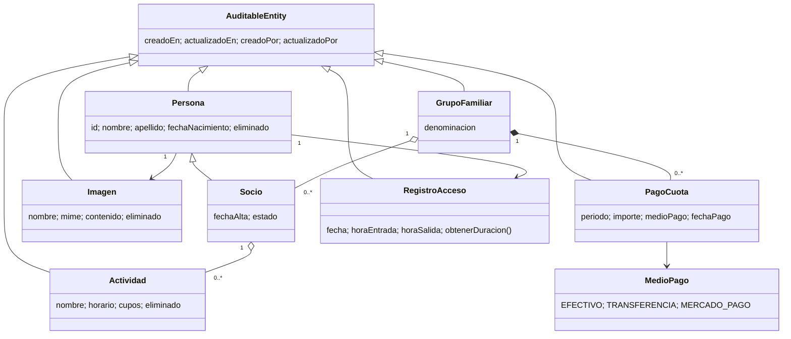

# Rediseño del dominio

El pago pertenece a `GrupoFamiliar`, no a `Socio`: la cuota es familiar y debe existir como máximo una vez para cada período. `MedioPago` es un enum extensible que actualmente contempla efectivo, transferencia y Mercado Pago.

## Capas

`ClubController` sólo traduce HTTP a DTO y vista. `PagoCuotaService` aplica la regla de negocio dentro de una transacción. Los repositorios abstraen JPA/PostgreSQL. Spring Security protege los casos de uso y Spring Data Auditing registra usuario y timestamps.
